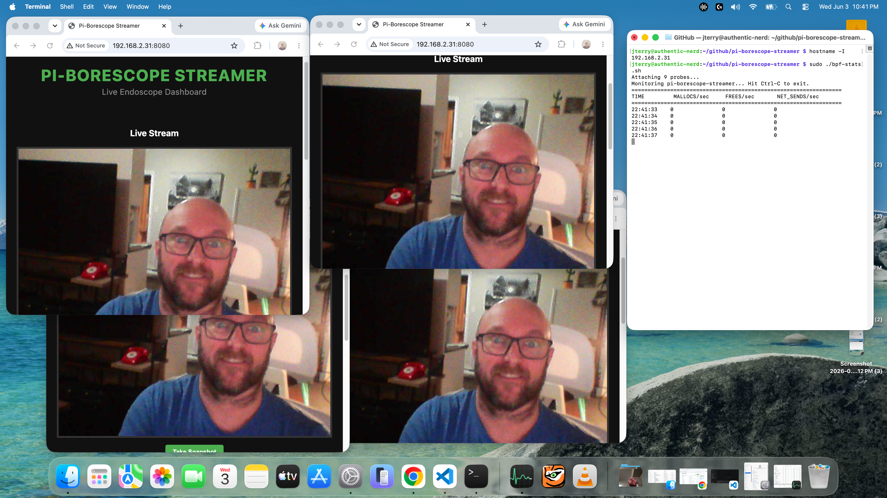

# pi-borescope-streamer

A high-performance, asynchronous, zero-allocation MJPEG streaming server designed specifically for Useeplus USB borescope cameras on the Raspberry Pi 5.

This project evolved from a simple synchronous USB-polling script into a robust, multi-client C++ streaming engine. It completely decouples the hardware ingestion thread from the network layer, allowing you to serve real-time video to multiple browser dashboards and VLC clients simultaneously with near-zero CPU overhead.



## 🚀 Features

- **Zero User-Space Memory Churn:** Built for long-running stability. The C++ video pipeline, HTTP header generation, and `uWebSockets` streaming multiplexer operate completely free of dynamic memory allocation. By pre-allocating persistent memory pools and utilizing zero-copy `std::span` payload views, the architecture completely eliminates user-space heap fragmentation. _(Note: The pipeline is so heavily optimized that eBPF profiling reveals the only remaining allocations on the entire hot path are the unavoidable `calloc` calls triggered by the underlying Linux `usbfs` kernel driver wrapping hardware URBs)._
- **Asynchronous Network Stack:** Powered by `uWebSockets` (an ultra-fast C++ `epoll` engine). A slow client on a bad Wi-Fi connection will never block the hardware camera thread.
- **Zero-Copy Broadcasting:** Video frames are streamed directly from pre-allocated memory pools with hardware-level efficiency, bypassing intermediate deep copies.
- **Multi-Client Support:** Stream to multiple browser tabs or VLC instances simultaneously with aggressive backpressure handling (automatically evicts lagging clients to protect server memory).
- **Client-Side Snapshots:** The web dashboard utilizes the HTML5 `<canvas>` API to capture high-resolution snapshots instantly on the user's device, completely removing image-processing overhead from the Raspberry Pi.

## 🛠️ Architecture Highlights

Most hobbyist MJPEG servers suffer from "buffer churn"—constantly resizing `std::string` or `std::vector` buffers to frame HTTP headers, which eats CPU cycles on embedded hardware.

`pi-borescope-streamer` avoids this by:

1. **Stack-Based Formatting:** HTTP multipart chunk boundaries and payload sizes are calculated entirely on the stack using `std::to_chars` and `std::format_to_n`.
2. **Double-Buffering Hardware IO:** `libusb` ingestion swaps memory blocks atomically, keeping the hardware mutex locked for less than a microsecond.
3. **Strict Memory Layouts:** The memory exchange zone (`SharedFramePipeline`) pre-allocates a fixed pool of memory buffers at startup, constantly recycling them between the USB hardware and network broadcaster to prevent leaks.

## 📦 Prerequisites

- **Hardware:** Raspberry Pi (Optimized for Pi 5, but runs on Pi 4/3)
- **Camera:** USB Borescope/Endoscope (Tested with Useeplus Hardware Rev 1.00 - VID: `0x2ce3`, `0x0329`)
- **OS:** Raspberry Pi OS (Debian Bookworm or newer)
- **Dependencies:**
  - `libusb-1.0-0-dev`
  - `cmake` (Version 3.10.0 or newer)
  - `ninja-build` (Highly recommended generator backend)
  - `pkg-config`
  - C++23 compliant compiler (`gcc` 13+ or `clang` 17+)

```bash
sudo apt update
sudo apt install libusb-1.0-0-dev cmake ninja-build pkg-config build-essential

```

## ⚙️ Build and Run Pi Borescope Streamer

The build will create the following apps:

- **pi-borescope-streamer**: MJPEG HTTP Web Server for streaming supercamera video feed
- **attached_usb_devices**: Console application that lists all attached USB devices
- **binary_stream_capture**: Console application for saving supercamera video feed in raw binary format
- **frame_extractor**: Console application that can extract and save individual JPEG frames from binary_stream_capture
- **v4l2-borescope-daemon**: Application to run in a daemon to pipe supercamera video feed into a virtual v4l2 device

### 1. Clone the repository

```bash
git clone [https://github.com/jerometerry/pi-borescope-streamer.git](https://github.com/jerometerry/pi-borescope-streamer.git)
cd pi-borescope-streamer

```

### 2. Compile

For a standard, optimized release build on target hardware:

```bash
cmake --preset release
cmake --build --preset release -j$(nproc)

```

> **Note:** For comprehensive build instructions—including running tests, performing static analysis (Clang-Tidy, Cppcheck), generating documentation, and setting up Visual Studio Code—please refer to the **[Build Guide (BUILD.md)](docs/BUILD.md)**.

### 3. Launch Pi Borescope Streamer

The application `pi-borescope-streamer` is a small web server designed to stream supercamera video feed to web browsers.

Run the binary out of its target profile directory. You can optionally specify a custom port (default is `8080`).

```bash
./out/build/release/pi-borescope-streamer

```

Once the camera is plugged in and the server is running, you can access the streams locally or across your network:

- **Interactive Web Dashboard (with Snapshots):** `http://<raspberry-pi-ip>:8080/`
- **Raw VLC MJPEG Stream:** `http://<raspberry-pi-ip>:8080/stream`

## 🔬 Advanced Documentation

Want to look under the hood? I have written a detailed guide on how to configure a Raspberry Pi kernel for eBPF and
generate CPU/Memory FlameGraphs to prove the zero-allocation architecture.

- [Running as a Video4Linux Daemon](docs/VIDEO4LINUX.md)
- [Running in Docker](docs/DOCKER.md)
- [Profiling using BPF and FlameGraphs](docs/PerformanceProfiling.md)
- [Useeplus Protocol Deep Dive](docs/UseeplusProtocol.md) - Hex dumps, hardware quirks, and frame assembly math.

## 🧠 Acknowledgements

This project was heavily inspired by the reverse-engineering work of
[hbens](https://github.com/hbens/geek-szitman-supercamera), [jmz3](https://github.com/jmz3/EndoscopeCamera), and
[doctormo](https://github.com/doctormo). Their original proofs-of-concept laid the groundwork for decoding the
`com.useeplus.protocol`.

## 📄 License

This project is licensed under the MIT License - see the [LICENSE](LICENSE) file for details.

For information regarding the third-party libraries used in this project, please see the
[THIRD_PARTY_LICENSES](THIRD_PARTY_LICENSES.md) file.
