# Useeplus Protocol

## Binary Stream Capture

Running a build will generate all binaries, including `binary_stream_capture`. This is a command line utility that
allows you to select an attached camera, and stream the incoming data to a binary file - `raw_camera_dump.bin` in the
current working directory.

**Build Script**

```bash
cmake . --preset release
cmake --build --preset release

```

**Capturing Stream Data**
To save the raw camera stream to a binary file for debugging and protocol analysis:

```bash
./out/build/release/binary_stream_capture

```

To view the raw camera data, use the `xxd` command to convert the binary file to hex, then pipe it to `grep`.

Because the Useeplus protocol uses little-endian byte order, the C++ constant `0xBBAA` appears on the wire as `aa bb`.
Here is a command that searches the binary file for this exact sequence, which serves as the packet delimiter. Each
line represents 16 bytes of data, grouped into 2-byte columns.

```bash
xxd raw_camera_dump.bin | grep -A 2 -B 2 "aa bb" | head -n 30

```

Here is an example of the output:

```text
000235e0: c007 d690 9084 e28e 7bd1 60b7 5171 c537  ........{.`.Qq.7
000235f0: a734 fa02 dac1 bb3d b349 9dc3 b8e6 919d  .4.....=.I......
00023600: b50e 0f5a 6d05 5968 7fff d9aa bb0b ab03  ...Zm.Yh........
00023610: 0800 0060 3330 24ff d8ff e000 104a 4649  ...`30$......JFI
00023620: 4600 0102 0100 4800 4800 00ff db00 8400  F.....H.H.......
--

```

## The Protocol Breakdown

By mapping this hex dump to our C++ implementation, we can decode the Useeplus hardware behavior:

* **The Hardware Handshake (`VENDOR_PRODUCT_ID_LIST`):** Before this stream even begins, `libusb` locates the hardware
using specific vendor and product IDs (e.g., `0x2ce3:0x3828` or `0x0329:0x2022`).
* **The Packet Delimiter (`USB_FRAME_HEADER`):** On line 3, we see the sequence `aa bb`. This matches our C++
definition of `0xBBAA` (Little-Endian) and marks the start of a new USB chunk.
* **The Camera ID (`VALID_CAMERA_IDS`):** The Useeplus hardware multiplexes two separate streams over the
USB pipe.
* Camera `11` (`0x0B`) is the **Video Feed** (transmitting 939-byte payloads).
* Camera `7` (`0x07`) is the **Gravity Sensor Feed** (transmitting 427-byte payloads).
* Decoding of the video feed requires explicitly filtering out packets matching Camera 7, or packets where the `hasGravitySensor` flag is true, to prevent injecting raw telemetry data directly into the Huffman-encoded JPEG stream.


* **The JPEG SOI Marker (`JPEG_SOI_MARKERS`):** On line 4, we see the sequence `ff d8`. This is the universal JPEG
Start of Image (SOI) marker. Due to hardware garbage padding, our decoder must actively scan the start of the buffer for this marker before assembling the final image.
* **The JPEG EOI Marker:** On line 3, the two bytes immediately preceding the `aa bb` delimiter are `ff d9`. This is
the universal JPEG End of Image (EOI) marker, cleanly terminating the previous video frame.
* **The App0 Segment:** Immediately after the SOI marker, we see `ff e0`, followed shortly by `4a 46 49 46 00`. This
translates to `JFIF` in ASCII, confirming the payload is a standard JPEG file format.

## The Chunk Metadata (The 7-Byte Payload Header)

The 2-byte USB_FRAME_HEADER `aa bb` (`UsbPacketHeader.header`) is followed by a 1-byte camera ID
(`UsbPacketHeader.cameraId`), and then 2-byte length specifier (`UsbPacketHeader.length`). These 5 bytes map to the
`UsbPacketHeader` struct.

```cpp
struct [[gnu::packed]] UsbPacketHeader {
    uint16_t header;
    uint8_t cameraId;
    uint16_t length;
};

```

Immediately following the 5-byte USB Packet Header (`aa bb 0b ab 03`), the camera inserts exactly 7 bytes of
proprietary `ChunkMetadata` before the actual JPEG pixels begin.

Let's look at the 12 bytes preceding the JPEG SOI (`ff d8`) from our hex dump:
`aa bb 0b ab 03` **`02 00 00 60 33 30 24`** `ff d8...`

This 7-byte block (**`02 00 00 60 33 30 24`**) is mapped directly to the `ChunkMetadata` struct.

```cpp
struct [[gnu::packed]] ChunkMetadata {
    uint8_t frameId;
    uint8_t cameraNumber;
    unsigned char hasGravitySensor:1;
    unsigned char buttonPress:1;
    unsigned char otherFlags:6;
    uint32_t gravitySensor;
};

```

`[[gnu::packed]]` ensures this structure fits flawlessly into exactly 7 bytes of memory without compiler padding.

ChunkMetadata controls the video assembly state machine and hardware interrupts:

* **The Frame ID:** This is a sequential packet identifier. Our state machine relies entirely on this byte. The exact moment the `frameId` changes, we know the previous frame has finished transmitting.
* **The Button Press Flag:** The physical hardware button flips the `buttonPress` bit to `1` for the duration of the press.
* **The Total Offset:** Because the `UsbPacketHeader` is 5 bytes and the `ChunkMetadata` is 7 bytes, we know
mathematically that the actual JPEG pixels *always* begin exactly **12 bytes** into the chunk payload.

## Assembling a Complete JPEG Frame

A single USB packet does not contain a full image.

* **The Payload Math:** Each hardware burst provides exactly **939 bytes** of valid payload (declared by the
`ab 03` length bytes). Because 12 bytes are consumed by headers, only **927 bytes** of pure JPEG data are provided per chunk.
* **The Frame Size:** Depending on the camera's resolution, a single MJPEG
frame typically ranges from **15,000 to 40,000 bytes** (15KB - 40KB).
* **The Assembly:** To transmit a 20KB image, the camera must send roughly 22 consecutive USB chunks. The **Frame ID** inside the metadata remains constant across all 22 chunks. Our `UsbFrameDecoder` continually appends the JPEG payloads to a buffer. When the Frame ID increments, the decoder initiates the "Dirty Start/Padded Tail" filter to slice the `FF D8` and `FF D9` bounds before flushing the image to the broadcast queue.

### Frame Assembly

This diagram illustrates how consecutive chunks are logically linked together by the `Frame ID` to form fully
bounded JPEG images.


## The 4KB Hardware Alignment Flaw (Ghost Headers)

If you look closely at the binary dump, you will notice gaps between chunks. The camera's physical endpoint natively forces its transmissions to align with **4096-byte (4KB) standard USB bulk transfer boundaries**.

To fit four 944-byte packets seamlessly into a 4096-byte page, the camera's firmware must inject 320 bytes of padding. It does this dynamically, leaving gaps of 0, 80, or 160 bytes between chunks.

The firmware fails to zero-initialize this padding. As a result, the camera leaks stale memory from its internal hardware buffer, creating "Ghost Headers" (stale `AA BB` markers) inside the padding.

Our C++ `UsbFrameDecoder` is explicitly designed to be immune to this flaw. By mathematically calculating `chunkTotalSize = sizeof(UsbPacketHeader) + header->length`, the parser leaps completely over the valid packet. It then uses a "Proximity Scanner" to peek ahead; if it sees an `AA BB` header, but detects *another* `AA BB` header less than 300 bytes away, it mathematically proves the first header is a ghost trap caused by 4KB padding, bypasses it, and safely resynchronizes with the stream.

### The 4KB Hardware Transfer Page

This diagram illustrates how the dynamic padding and memory leaks interact with the 4KB microframe boundary.

```mermaid
flowchart LR
    subgraph Buffer ["Single 4096-Byte (4KB) USB Hardware Page"]
        direction LR
        
        C1["Packet 1<br/>(944 Bytes)"]
        P1["Padding<br/>(0 Bytes)"]
        C2["Packet 2<br/>(944 Bytes)"]
        P2["Ghost Padding<br/>(80 Bytes)"]
        C3["Packet 3<br/>(944 Bytes)"]
        P3["Ghost Padding<br/>(80 Bytes)"]
        C4["Packet 4<br/>(944 Bytes)"]
        P4["Ghost Padding<br/>(160 Bytes)"]

        C1 --- P1 --- C2 --- P2 --- C3 --- P3 --- C4 --- P4
    end

    %% Visual Styling
    style C1 fill:#10b981,stroke:#064e3b,stroke-width:2px,color:#fff
    style C2 fill:#10b981,stroke:#064e3b,stroke-width:2px,color:#fff
    style C3 fill:#10b981,stroke:#064e3b,stroke-width:2px,color:#fff
    style C4 fill:#10b981,stroke:#064e3b,stroke-width:2px,color:#fff
    
    style P1 fill:#ef4444,stroke:#7f1d1d,stroke-width:2px,stroke-dasharray: 5 5,color:#fff
    style P2 fill:#ef4444,stroke:#7f1d1d,stroke-width:2px,stroke-dasharray: 5 5,color:#fff
    style P3 fill:#ef4444,stroke:#7f1d1d,stroke-width:2px,stroke-dasharray: 5 5,color:#fff
    style P4 fill:#ef4444,stroke:#7f1d1d,stroke-width:2px,stroke-dasharray: 5 5,color:#fff

```



## Binary Stream Frame Extractor

To verify my understand of the Useeplus protocol, I used the binary stream capture to extract individual frames to 
disk. 

Run the `frame_extractor` command, passing it the path to the binary file, and the index of the frame from the file
you want to extract (indexed from 1).

```bash
pi-borescope-streamer % ./out/build/debug/frame_extractor ./raw_camera_dump.bin 1
[Scanner] Reconstructing libusb hardware blocks...
[Success] Extracted flawless frame 1 (22209 bytes) to: extracted_frame_1.jpg
pi-borescope-streamer % ./out/build/debug/frame_extractor ./raw_camera_dump.bin 2
[Scanner] Reconstructing libusb hardware blocks...
[Success] Extracted flawless frame 2 (22294 bytes) to: extracted_frame_2.jpg
pi-borescope-streamer % ./out/build/debug/frame_extractor ./raw_camera_dump.bin 100
[Scanner] Reconstructing libusb hardware blocks...
[Error] Frame assembled, but missing valid JPEG delimiters.
[Info] Dumped raw payload to corrupt_frame_debug.jpg
pi-borescope-streamer % 
```