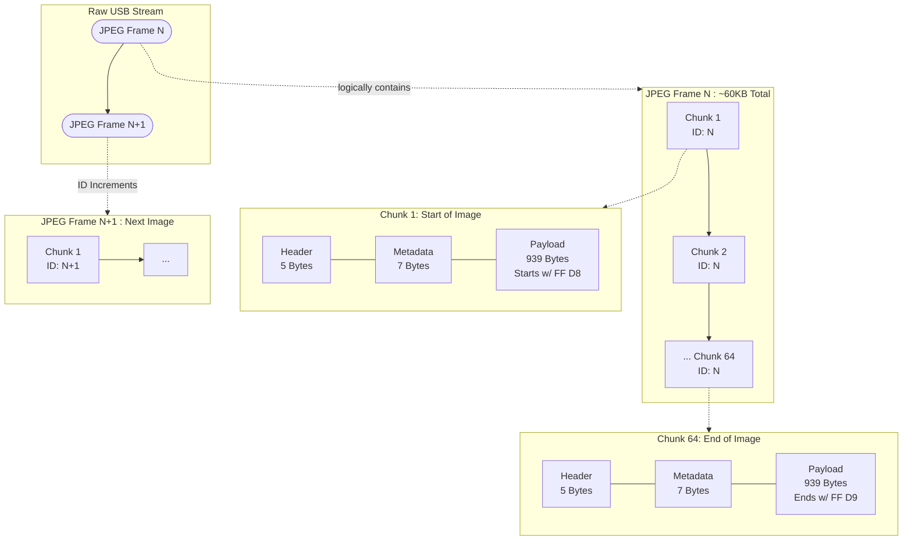

# Useeplus Protocol

## Binary Stream Capture

Running a build will generate all binaries, including `binary_stream_capture`. This is a command line utility that 
allows you to select an attached camera, and stream the incoming data to a binary file - `raw_camera_dump.bin` in the 
current working directory.

**Build Script**

```bash
cmake . --preset release
cmake --build --preset release
```

**Capturing Stream Data**
To save the raw camera stream to a binary file for debugging and protocol analysis:

```bash
./out/build/release/binary_stream_capture
```

To view the raw camera data, use the `xxd` command to convert the binary file to hex, then pipe it to `grep`.

Because the Useeplus protocol uses little-endian byte order, the C++ constant `0xBBAA` appears on the wire as `aa bb`. 
Here is a command that searches the binary file for this exact sequence, which serves as the packet delimiter. Each 
line represents 16 bytes of data, grouped into 2-byte columns.

```bash
xxd raw_camera_dump.bin | grep -A 2 -B 2 "aa bb" | head -n 30
```

Here is an example of the output:

```text
000235e0: c007 d690 9084 e28e 7bd1 60b7 5171 c537  ........{.`.Qq.7
000235f0: a734 fa02 dac1 bb3d b349 9dc3 b8e6 919d  .4.....=.I......
00023600: b50e 0f5a 6d05 5968 7fff d9aa bb0b ab03  ...Zm.Yh........
00023610: 0800 0060 3330 24ff d8ff e000 104a 4649  ...`30$......JFI
00023620: 4600 0102 0100 4800 4800 00ff db00 8400  F.....H.H.......
--
```

## The Protocol Breakdown

By mapping this hex dump to our C++ implementation, we can decode the Useeplus hardware behavior:

* **The Hardware Handshake (`VENDOR_PRODUCT_ID_LIST`):** Before this stream even begins, `libusb` locates the hardware 
using specific vendor and product IDs (e.g., `0x2ce3:0x3828` or `0x0329:0x2022`).
* **The Packet Delimiter (`USB_FRAME_HEADER`):** On line 3, we see the sequence `aa bb`. This matches our C++ 
definition of `0xBBAA` (Little-Endian) and marks the start of a new USB chunk.
* **The Camera ID (`VALID_CAMERA_IDS`):** Immediately following the `aa bb` header is the byte `0b`. In decimal, 
`0x0B` is `11`. This matches our supported array `{7, 11}`, proving the chunk came from a valid sensor.
* **The JPEG SOI Marker (`JPEG_SOI_MARKERS`):** On line 4, we see the sequence `ff d8`. This is the universal JPEG 
Start of Image (SOI) marker. Our decoder expects to find this marker within the first 32 bytes of the payload 
(`JPEG_SOI_MARKERS_MAX_POSITION`).
* **The JPEG EOI Marker:** On line 3, the two bytes immediately preceding the `aa bb` delimiter are `ff d9`. This is 
the universal JPEG End of Image (EOI) marker, cleanly terminating the previous video frame just before the new header 
begins.
* **The App0 Segment:** Immediately after the SOI marker, we see `ff e0`, followed shortly by `4a 46 49 46 00`. This 
translates to `JFIF` in ASCII, confirming the payload is a standard JPEG file format.

## The Chunk Metadata (The 7-Byte Payload Header)

The 2-byte USB_FRAME_HEADER `aa bb` (`UsbPacketHeader.header`) is followed by a 1-byte camera ID 
(`UsbPacketHeader.cameraId`), and then 2-byte length specifier (`UsbPacketHeader.length`). These 5 bytes map to the 
`UsbPacketHeader` struct. 

```
struct [[gnu::packed]] UsbPacketHeader {
    uint16_t header;
    uint8_t cameraId;
    uint16_t length;
};
```

Immediately following the 5-byte USB Packet Header (`aa bb 0b ab 03`), the camera inserts exactly 7 bytes of 
proprietary `ChunkMetadata` before the actual JPEG pixels begin.

Let's look at the 12 bytes preceding the JPEG SOI (`ff d8`) from our hex dump:
`aa bb 0b ab 03` **`02 00 00 60 33 30 24`** `ff d8...`

This 7-byte block (**`02 00 00 60 33 30 24`**) is mapped directly to our C++ `ChunkMetadata` struct. 

```
struct [[gnu::packed]] ChunkMetadata {
    uint8_t frameId;
    uint8_t cameraNumber;
    unsigned char hasGravitySensor:1;
    unsigned char buttonPress:1;
    unsigned char otherFlags:6;
    uint32_t gravitySensor;
};
```

It controls the video assembly state machine and hardware interrupts:

* **The Button Press Flag:** The Useeplus cable features a physical hardware button. When squeezed, the camera does 
*not* send a separate USB interrupt. Instead, it flips a specific bit (`buttonPress`) inside this metadata block to `1` 
for the duration of the press.
* **Hardware Interrupts:** Our decoder checks `metadata->buttonPress` on every single chunk. If it detects a `1`, it 
fires the `hardwareButtonCallback()`, which evaluates the duration of the press to determine if it was a quick click 
(triggering a high-res snapshot) or a long hold (a hardware-level lens toggle that we safely ignore).
* **The Total Offset:** Because the `UsbFrame` header is 5 bytes and the `ChunkMetadata` is 7 bytes, we know 
mathematically that the actual JPEG pixels *always* begin exactly **12 bytes** into the kernel buffer.

## Assembling a Complete JPEG Frame

While the hex dump above shows individual USB packets, a single packet does not contain a full image.

* **The Payload Math:** Each hardware burst provides exactly **939 bytes** of valid JPEG payload (declared by the 
`ab 03` length bytes).
* **The Frame Size:** Depending on the camera's resolution and the visual complexity of the scene, a single MJPEG 
frame typically ranges from **30,000 to 100,000 bytes** (30KB - 100KB).
* **The Assembly:** To transmit a 60KB image, the camera must send roughly 64 consecutive USB chunks. The **Frame ID** 
inside the metadata remains constant across all 64 chunks. Our `UsbFrameDecoder` continually appends the 939-byte 
payloads to a buffer. The exact moment the Frame ID increments, the decoder knows the image is complete and flushes the 
fully assembled JPEG to the broadcast queue.

*(Note: If you run the `binary_stream_capture` tool for just 3 to 5 seconds at 30 FPS, your `raw_camera_dump.bin` file 
will contain between 90 and 150 completely intact, fully extractable JPEG images!)*

### Macro Layout: Frame Assembly

This diagram illustrates how consecutive 1KB chunks are logically linked together by the `Frame ID` to form fully 
bounded JPEG images.



## The Hardware Fragmentation Flaw (The 1104-Byte Bug)

If you look closely at the binary dump, you will notice that the payload length declared in the USB header is usually 
around `939` bytes. However, the camera's physical endpoint natively transmits in **1,104-byte** bursts.

Because High-Speed USB 2.0 uses 512-byte packets, the Linux kernel receives `512 + 512 + 80 = 1104` bytes. The camera's 
firmware fails to initialize the final 80 bytes of this burst, resulting in a memory leak that transmits "ghost" 
padding containing stale headers from previous frames.

Our C++ `UsbFrameDecoder` is explicitly designed to be immune to this flaw. By reading a 1MB buffer and strictly 
bounding our vector insertion to the declared `header->length`, we extract the valid JPEG data and surgically discard 
the uninitialized hardware memory leak.

### Micro Layout: The 1024-Byte Kernel Buffer

This diagram is perfect for the "Hardware Fragmentation Flaw" section. It visually breaks down a single 1024-byte read 
array, highlighting the 12-byte safety offset and the 80 bytes of corrupted hardware memory that the V1 decoder drops.

```mermaid
flowchart LR
    subgraph Buffer [Single 1024-Byte libusb Read Buffer]
        direction LR
        
        H[USB Header<br/>5 Bytes<br/>AA BB 0B AB 03]
        M[Chunk Metadata<br/>7 Bytes<br/>ID, Flags, Button]
        P[Valid JPEG Payload<br/>939 Bytes<br/>(Extracted by C++)]
        G[Ghost Padding<br/>80 Bytes<br/>(Safely Ignored)]

        H --- M --- P --- G
    end

    %% Visual Styling
    style H fill:#3b82f6,stroke:#1e3a8a,stroke-width:2px,color:#fff
    style M fill:#8b5cf6,stroke:#4c1d95,stroke-width:2px,color:#fff
    style P fill:#10b981,stroke:#064e3b,stroke-width:2px,color:#fff
    style G fill:#ef4444,stroke:#7f1d1d,stroke-width:2px,stroke-dasharray: 5 5,color:#fff

```
